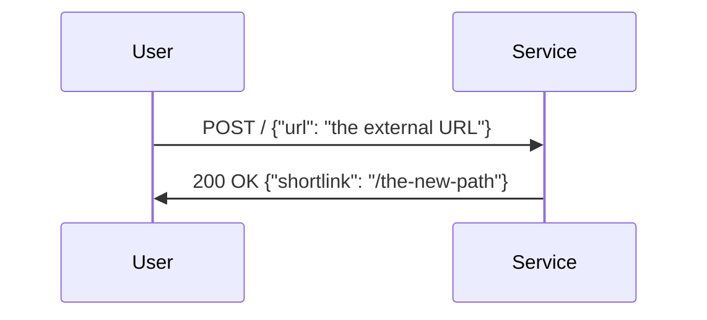
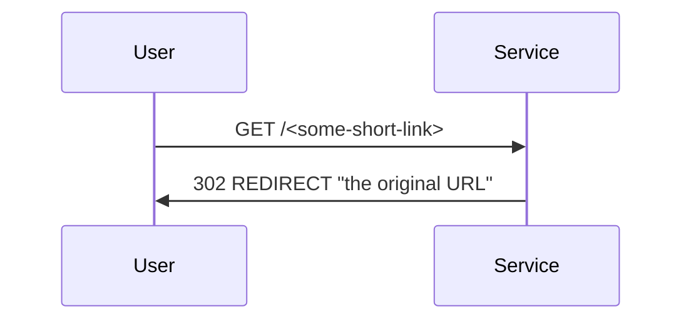
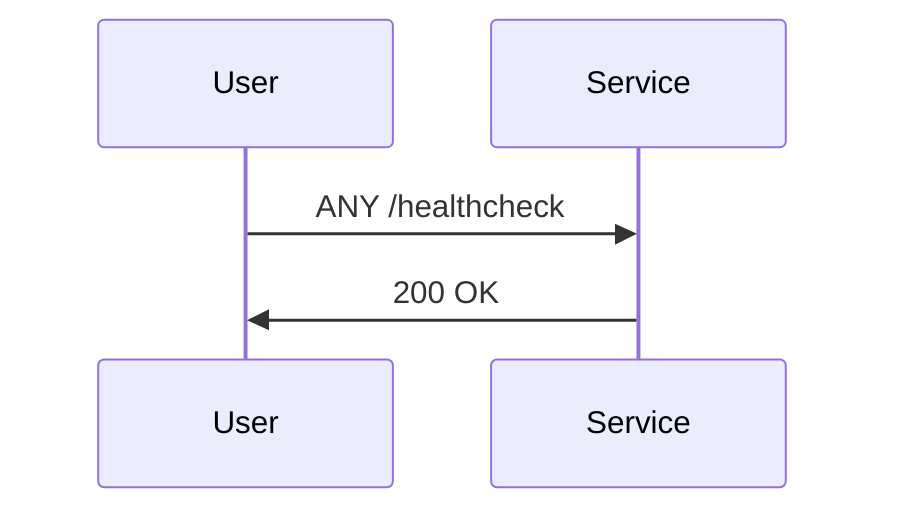

# Deployed Application:
LINK: https://0p7lrukng9.execute-api.us-east-1.amazonaws.com/prod

# Application Purpose
This is a URL shortening service that provides the ability to shorten web addresses to a 5-10 characters string. Once a link has been shortened you can call `GET: <API-URL>/<random-generated-string>` to be redirected to the full web address that the string belongs to.








# Architecture
I used serverless AWS infrastructure to ensure that service is higly scaleable and not charging me when it's not being used.

For this stack, I have an `AWS APIGateway` that listens for requests and uses `AWS Lambda Function` to process the request and stores necessary data in a `AWS DynamoDB` table. I have left the table outside of the CDK for data retention purposes. I don't want the data to be deleted if `cdk destroy` was run. Hence, the AWS DynamoDB is managed manually.

We have also used a combination of `GitHub Actions` and python `AWS CDK` to automate the build and deploy process.

The Lambda function is created with `Python Boto3 library` that helps are use python code to process request as well as post and retrieve data from the database. I have also use Flask framework to handle links entered by users and redirect them to the website that they are really looking for! I have also added a healthcheck path that helps you diagnose if the service is up or not.


# Process
Upon pushing changes to the main branch (with the exception of the `README.md` file) a GitHub action will be triggered that builds the app and updates the AWS Lambda function with the updated code.

NOTE: The POST Method has been protected with IAM policy. You need to manually add a user to the `urlshortneradmins` group if they wish to make POST request to the API endpoint.


<br/><br/><br/><br/><br/>

# AWS CDK Documentation
# Welcome to your CDK Python project!

This is a blank project for CDK development with Python.

The `cdk.json` file tells the CDK Toolkit how to execute your app.

This project is set up like a standard Python project.  The initialization
process also creates a virtualenv within this project, stored under the `.venv`
directory.  To create the virtualenv it assumes that there is a `python3`
(or `python` for Windows) executable in your path with access to the `venv`
package. If for any reason the automatic creation of the virtualenv fails,
you can create the virtualenv manually.

To manually create a virtualenv on MacOS and Linux:

```
$ python3 -m venv .venv
```

After the init process completes and the virtualenv is created, you can use the following
step to activate your virtualenv.

```
$ source .venv/bin/activate
```

If you are a Windows platform, you would activate the virtualenv like this:

```
% .venv\Scripts\activate.bat
```

Once the virtualenv is activated, you can install the required dependencies.

```
$ pip install -r requirements.txt
```

At this point you can now synthesize the CloudFormation template for this code.

```
$ cdk synth
```

To add additional dependencies, for example other CDK libraries, just add
them to your `setup.py` file and rerun the `pip install -r requirements.txt`
command.

## Useful commands

 * `cdk ls`          list all stacks in the app
 * `cdk synth`       emits the synthesized CloudFormation template
 * `cdk deploy`      deploy this stack to your default AWS account/region
 * `cdk diff`        compare deployed stack with current state
 * `cdk docs`        open CDK documentation

Enjoy!
